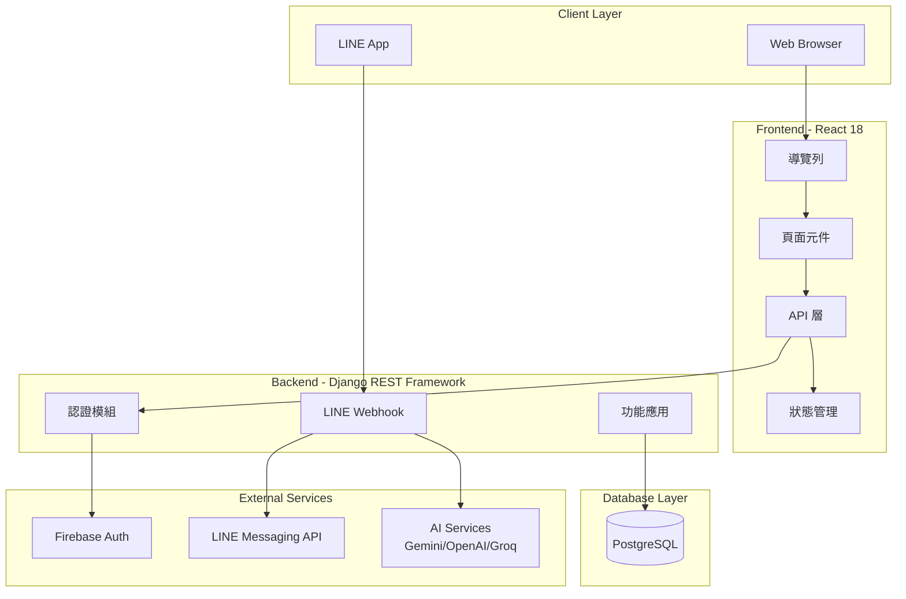
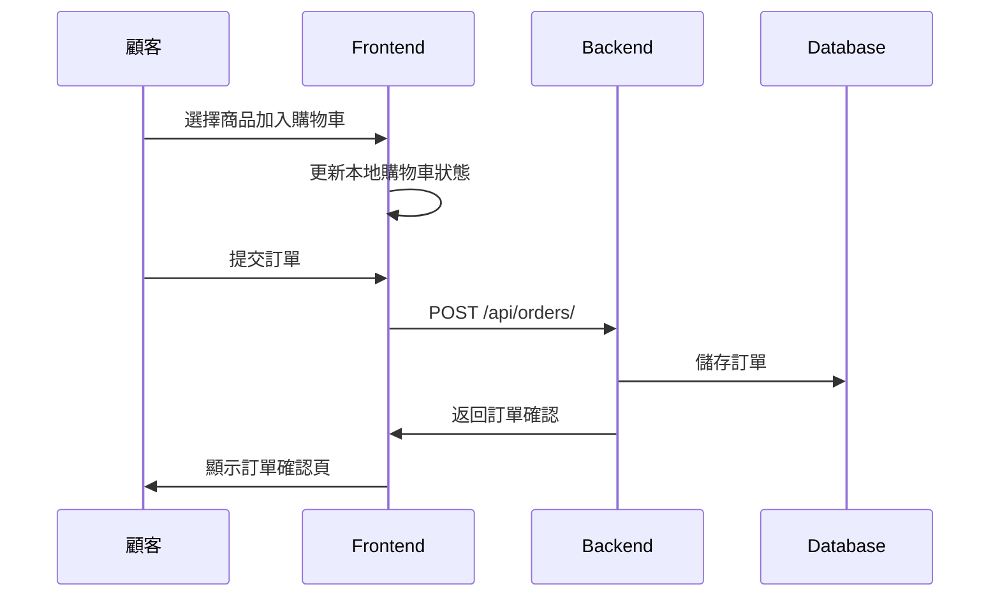
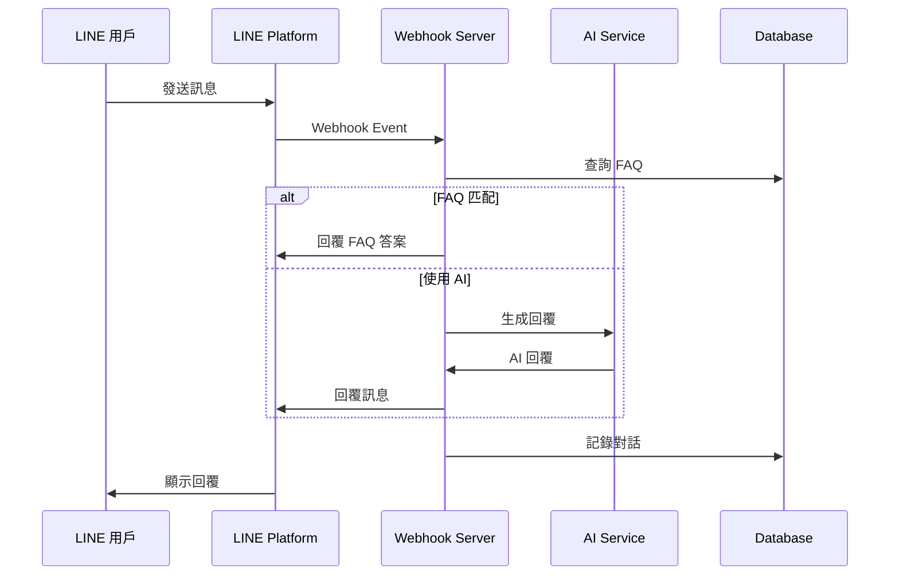

# DineVerse 系統架構

## 系統架構圖



## 技術架構分層

### 1. 前端層 (Frontend)
- **框架**: React 18.3.1
- **路由**: React Router DOM 7.9.4
- **UI 元件**: Material UI 7.3.6
- **狀態管理**: React Context
- **HTTP 客戶端**: Axios

### 2. 後端層 (Backend)
- **框架**: Django 4.x + Django REST Framework
- **認證**: JWT (Simple JWT) + Firebase
- **API 格式**: RESTful JSON

### 3. 資料層 (Database)
- **主資料庫**: PostgreSQL
- **即時驗證**: Firebase Authentication

### 4. 外部服務
- **Firebase**: 使用者身份驗證
- **LINE Messaging API**: 聊天機器人
- **AI APIs**: 智能回覆服務

## 部署架構

```
                    ┌─────────────────────┐
                    │    Load Balancer    │
                    └──────────┬──────────┘
                               │
           ┌───────────────────┼───────────────────┐
           │                   │                   │
    ┌──────▼──────┐     ┌──────▼──────┐     ┌──────▼──────┐
    │  Frontend   │     │   Backend   │     │   Backend   │
    │   (React)   │     │  (Django)   │     │  (Django)   │
    │   :3000     │     │   :8000     │     │   :8000     │
    └─────────────┘     └──────┬──────┘     └──────┬──────┘
                               │                   │
                        ┌──────▼───────────────────▼──────┐
                        │         PostgreSQL              │
                        │          Database               │
                        └─────────────────────────────────┘
```

## 資料流程

### 訂單流程


### LINE BOT 流程

